# AceCards 使用说明

## 1 登录

访问 [AceCards](https://acecards.yzzx.org:444/#/) 

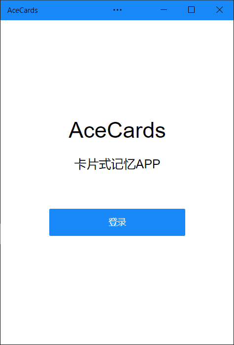

点击登录，浏览器将会跳转到第四方登录平台，选择一项进行第三方登录。

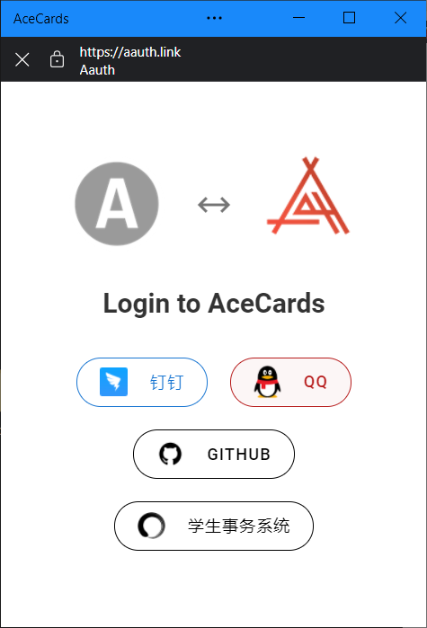

若浏览器支持，将可以将 AceCards 安装到手机主屏幕上，获得手机原生APP的体验。

底部导航栏选择不同选项卡，进入对应页面。

## 2 卡组

若此时没有卡组，可点击“新建卡组”按钮新建

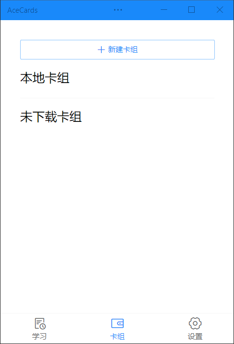

### 新建卡组

在新建卡组页面，将会展示出可供使用的卡组列表，点击“+”按钮可添加卡组，点击“返回”可返回卡组页

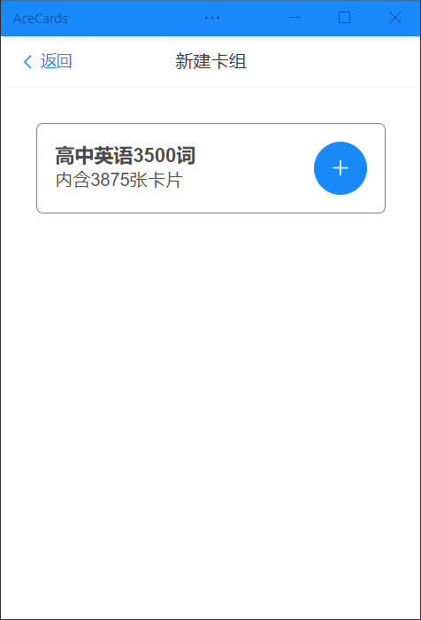

新建卡组设置中，可对卡组名称进行自定义，还可将卡组设置为顺序或是乱序

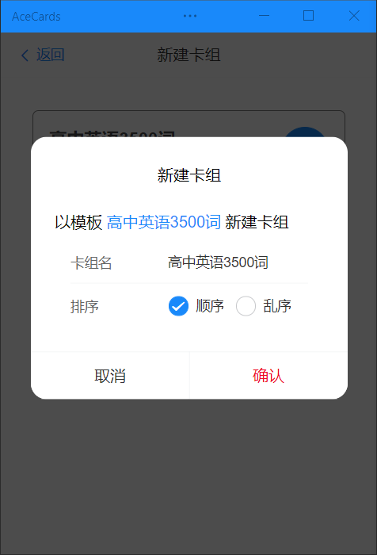

新建完成后，将会跳转到卡组页，刚新建的卡组将显示在“未下载卡组”栏中。

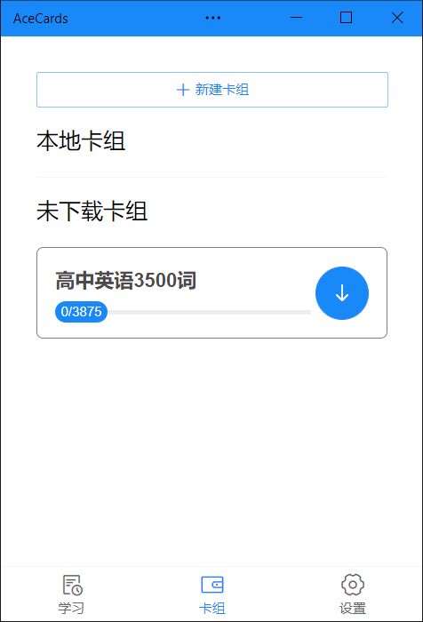

为了使用卡组，点击卡组的下载按钮将其下载到本地，下载完成后，卡组将出现在“本地卡组”一栏。

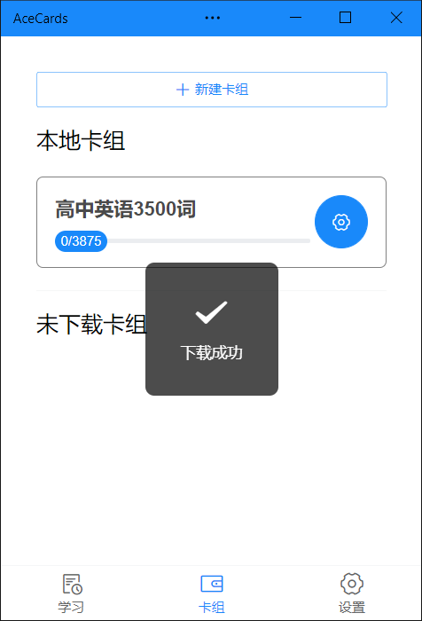

此时点击卡组右侧的设置按钮可对卡组进行设置，含义如选项。

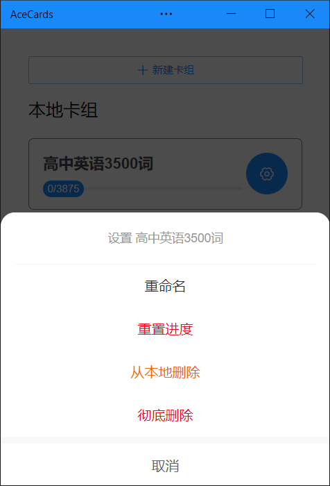

## 3 学习

学习页将显示全部本地卡组，若当前卡组内容需要复习，则会出现在“待复习卡组”中，否则将出现在“其他卡组”中。卡组名称下方的进度条指示了学习进度。

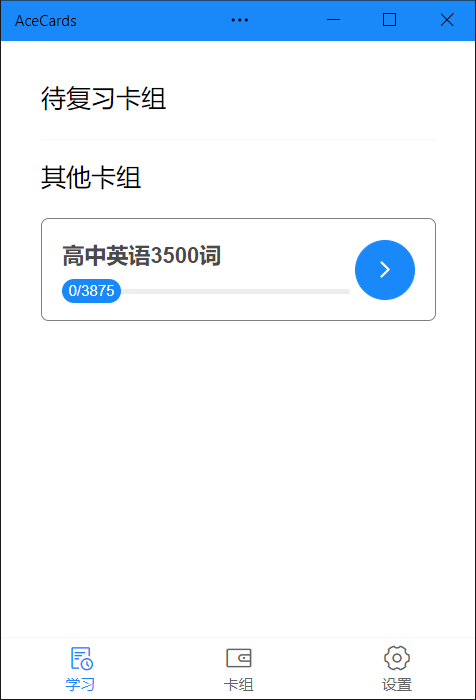

点击卡组右侧箭头，将弹出学习选项。

- 智能复习：根据遗忘算法，智能选择有可能需要复习的卡片以复习
- 学习+智能复习：与智能复习类似，在复习已学习卡片的基础上学习新卡片
- 乱序逐个复习：将卡组中的已学卡片打乱，逐个过关

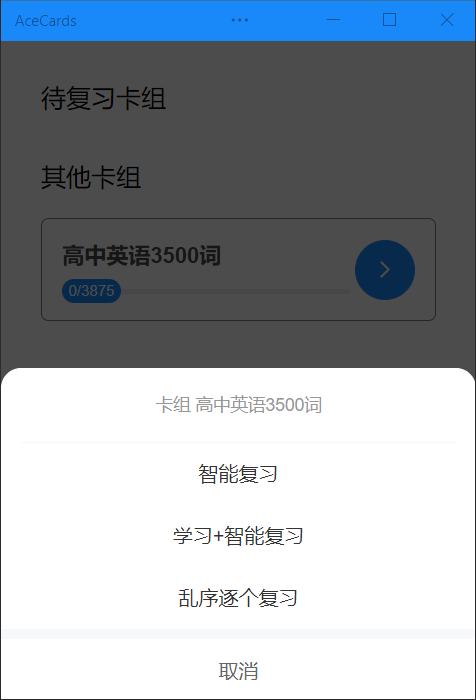

其中，“学习+智能复习”可以设置本次学习的卡片数量。

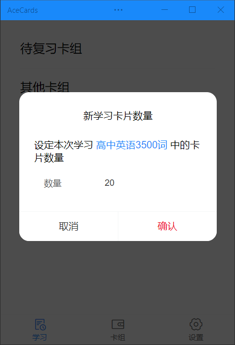

确认进入学习页面。页面主体即为当前卡片，点击下方按钮查看卡片反面。

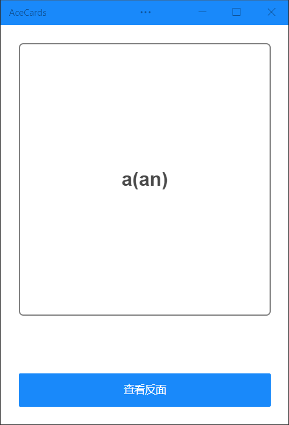

查看反面时，根据自身情况选择“记得”或是“不记得”，系统将会根据选项智能规划复习的时机。

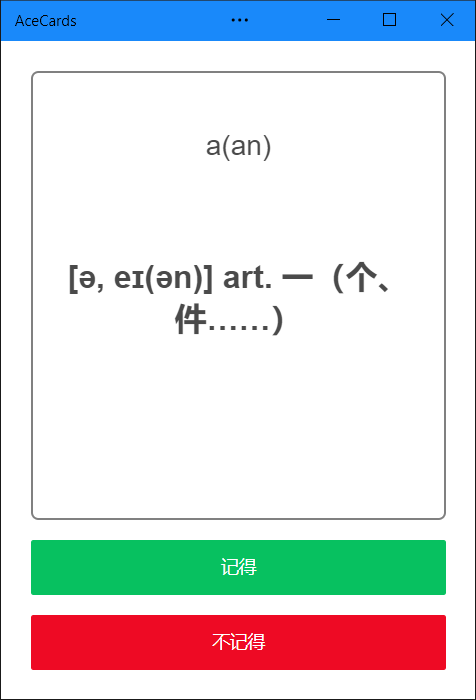

注意：为了达到专注的目的，学习过程中无法退出，强行退出，学习进度将不会保存。

## 4 设置

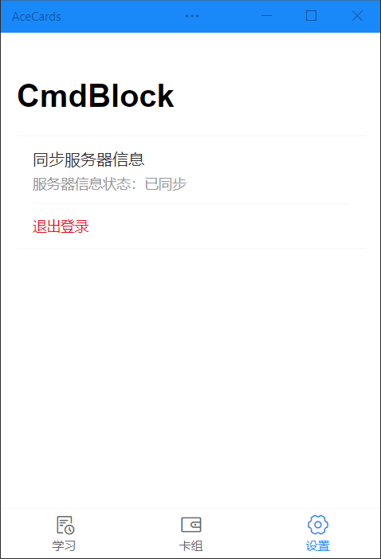

- 同步服务器信息：当您在离线状态下使用 AceCards，产生的数据将会暂时缓存在本地。点击可手动向服务器同步缓存。
- 退出登录